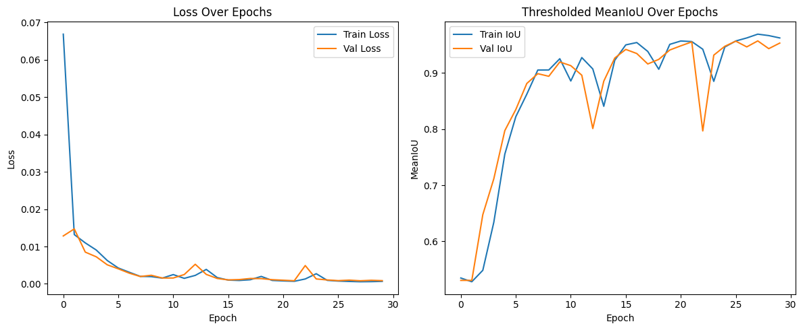
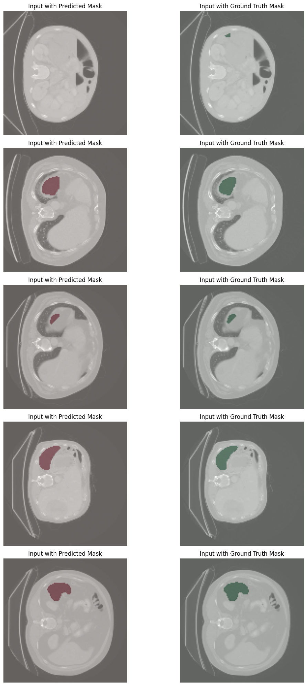
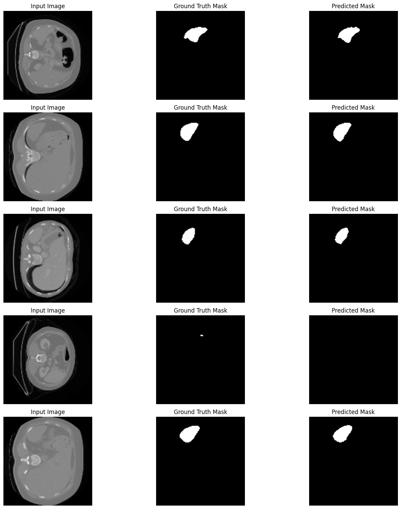

# 🧬 SpleenNET - Deep Learning for Spleen Segmentation in CT Scans

**SpleenNET** is a convolutional neural network-based medical image segmentation model built to detect and isolate the spleen from abdominal CT images. It leverages a U-Net architecture and is trained on 2D slices to perform pixel-wise classification.

---

## 🧠 Project Overview

- **Goal**: Segment spleen regions from CT scan images with high accuracy  
- **Architecture**: U-Net-like CNN with skip connections  
- **Application**: Medical imaging, radiology assistance, organ volume analysis  

---

## 📂 Dataset

- **Input**: 2D axial CT slices (grayscale)  
- **Label**: Binary segmentation masks (1 = spleen, 0 = background)  
- **Source**: Adapted from public datasets (e.g., Medical Segmentation Decathlon)  

> *Note: Raw datasets are not included due to privacy/medical regulations.*

---

## 🏗️ Model Architecture

- **Encoder**: Convolution → BatchNorm → MaxPool  
- **Decoder**: Transposed Convolution + Skip Connections  
- **Loss Function**: Dice Loss + Binary Cross Entropy  
- **Metrics**: Dice Coefficient, IoU, Accuracy  

---

## Training Performance

<p align="center">  </p>

---

## Sample Outputs

🩻 Overlay: Predicted Mask vs Ground Truth Mask
<p align="center">  </p>

---

## Input|Ground_Truth|Prediction

<p align="center">  </p>

---

## 🛠️ Requirements

```bash
pip install numpy matplotlib opencv-python scikit-image tensorflow
